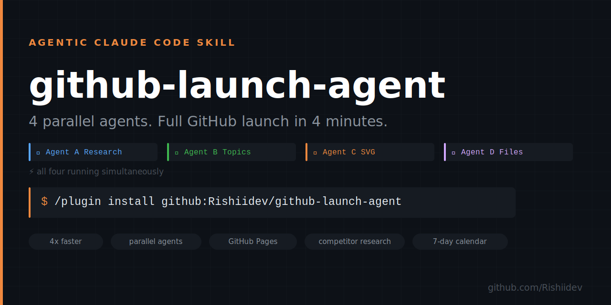

# ⚡ github-launch-agent — Full GitHub Launch in 4 Minutes

<div align="center">
  
  <br/><br/>

**4 parallel agents cut the full GitHub launch pipeline from 20 minutes to 4. Research-backed README. SEO name scoring. Auto-embedded social preview. GitHub Pages site. 7-day distribution calendar.**

[](https://github.com/Rishiidev/github-launch-agent/stargazers)
[](https://github.com/Rishiidev/github-launch-agent/actions)
[](LICENSE)
[](https://github.com/Rishiidev/github-launch-agent/releases)

*Works in Claude Code · Cowork · Claude.ai — no CLI setup, one trigger phrase.*

</div>

> The agentic evolution of `claude-github-launch`. Same full pipeline — 16 parallel agents across 3 phases replace sequential steps, cutting time from 20 minutes to 4 while improving README quality through live competitor research.

---

## The Problem

Sequential launch works. But on step 6 of 14, attention drops. The README becomes
"good enough." Distribution content gets copy-pasted without reading. The social
preview upload is skipped because you're already exhausted.

Time compounds attention. Every extra minute in the pipeline costs output quality.

## The Fix

```
agentic github launch
```

Phase 1 spawns 4 agents simultaneously:
- **Agent A** reads your project, extracts the value prop and measurable benefit
- **Agent B** researches the top 3 similar repos and mines their README patterns
- **Agent C** generates the social preview SVG and embeds it in your README
- **Agent D** writes CHANGELOG, .gitignore, CONTRIBUTING, and LICENSE

While you wait 4 minutes instead of 20, Agent B is benchmarking your README against
repos that already converted visitors into stars.

---

## Install

| Platform | Command |
|----------|---------|
| **Claude Code** | `/plugin install github:Rishiidev/github-launch-agent` |
| **Cowork** | `/plugin install github:Rishiidev/github-launch-agent` |
| **Claude.ai** | Download [`.skill` file](../../releases/latest) → import |

---

<div align="center">
<b>If this saves you the "I launched but nobody found it" problem — star it. Takes 2 seconds.</b><br>
<a href="https://github.com/Rishiidev/github-launch-agent">⭐ Star on GitHub</a>
</div>

---

## Base vs Agentic

| | `claude-github-launch` | **`github-launch-agent` (this)** |
|-|----------------------|--------------------------------|
| Time | ~15–20 min | **~4–6 min** |
| Execution | Sequential, 14 steps | **Parallel, 3 phases, 16 agents** |
| README quality | From your project files | **+ competitor README research** |
| Name decision | "I'll suggest one" | **5 candidates scored, ranked** |
| Repo description | 1 generated | **5 scored, you pick** |
| Social preview | Generated + manual upload | **Auto-embedded in README header** |
| GitHub Pages | ✗ | **✓ landing page + repo homepage** |
| Distribution | Ready-to-paste text | **Text + 7-day timed calendar** |

---

## How It Works

```
STEP -1   Name scoring        5 candidates ranked before anything else
STEP  0   Collect inputs      5 questions (name already resolved)
STEP  1   Pre-flight          auth · secrets · git state

══════════════════ PARALLEL PHASE 1 ══════════════════
  Agent A   Project intelligence   value prop · trigger · platforms
  Agent B   Competitor research    topics · README patterns · descriptions
  Agent C   Social preview SVG     generated + embedded in README
  Agent D   Supporting files       CHANGELOG · .gitignore · CONTRIBUTING · LICENSE · FUNDING.yml · SECURITY.md
══════════════════════════════════════════════════════

  SYNTHESIS   Merge → README (SVG embedded) · plugin.json · marketplace.json · CI workflow

  GIT OPS     init → create repo → push

══════════════════ PARALLEL PHASE 2 ══════════════════
  Agent E   Topics + description   all 20 SEO topics set
  Agent F   Discussions + issues   enabled
  Agent G   Labels → issue         5 labels · tailored good-first-issue
  Agent H   Release                v1.0.0 + .skill attachment
══════════════════════════════════════════════════════

  PAGES       docs/index.html generated + GitHub Pages enabled
  DISCUSSIONS Seeded welcome post
  STORYBOARD  .github/record-demo.sh — 30s terminal demo script
  VALIDATE    all artifacts checked

══════════════════ PARALLEL PHASE 3 ══════════════════
  Agent I   Reddit post            r/ClaudeAI, ready to paste
  Agent J   X/Twitter thread       4-tweet thread, ready to paste
  Agent K   HN Show HN             title + body, ready to post
  Agent L   Awesome-list PR        target found, markdown line + PR drafted
  Agent M   LinkedIn post          technical, ready to paste
  Agent N   Product Hunt copy      tagline + description + first comment + gallery
  Agent O   Newsletter pitches     tailored for TLDR AI, The Rundown AI, Ben's Bites
  Agent P   DEV.to article         700-900 word technical article, ready to publish
══════════════════════════════════════════════════════

  CALENDAR   7-day plan with absolute dates and posting windows
  REPORT     full summary with all links and counts
```

---

## What Makes It Different: Competitor Research

Agent B doesn't just search for topics — it fetches the first 120 lines of the top 3
similar repos' READMEs and extracts:

- **Headline format**: does it include a number? Statement or question?
- **Install placement**: early (first 30 lines) vs middle vs late
- **Star CTA position**: where do high-star repos place it?
- **Value prop style**: outcome-first vs feature-first vs problem-first

The README is written from a benchmark, not from scratch.

---

## What It Builds

```
your-project/
├── .claude-plugin/
│   ├── plugin.json              ← top-scored description, Pages homepage
│   └── marketplace.json
├── skills/<name>/
│   └── SKILL.md                 ← never overwritten if exists
├── .github/
│   ├── FUNDING.yml              ← Sponsor button on repo page
│   ├── ISSUE_TEMPLATE/
│   │   ├── feature-request.yml
│   │   └── bug-report.yml
│   ├── record-demo.sh           ← 30-second demo storyboard + asciinema script
│   └── workflows/
│       └── validate.yml         ← CI badge from day 1
├── assets/
│   └── social-preview.svg       ← embedded in README, set as OG image
├── docs/
│   └── index.html               ← GitHub Pages site, click-to-copy install
├── README.md                    ← SVG hero + competitor-benchmarked structure
├── CHANGELOG.md                 ← real date, v1.0.0
├── CONTRIBUTING.md
├── SECURITY.md                  ← vulnerability reporting via GitHub Issues
├── LICENSE
└── .gitignore                   ← language-specific
```

---

## What Never Gets Touched

| Protected | Why |
|-----------|-----|
| Existing SKILL.md | Never overwritten — checked before writing |
| `.env` files | Pipeline stops if any found, lists them all |
| Git history | Commit message adapts, history never rewritten |
| Repo homepage | Only set to GitHub Pages URL — never the repo itself |

---

## GitHub Pages

When enabled (default: yes), the skill auto-generates `docs/index.html` — a dark-themed
landing page at `your-username.github.io/<repo-name>` with:
- Social preview as hero image (via raw GitHub URL, no path issues)
- Click-to-copy install command
- Feature cards
- Link back to the GitHub repo

This URL is set as the official repo homepage. Google indexes it. Shareable in your bio.
Enabled via GitHub API — no manual steps.

---

## Trigger Phrases

| Say this | Result |
|----------|--------|
| `agentic github launch` | Full parallel pipeline |
| `parallel github launch` | Full parallel pipeline |
| `fast github launch` | Full parallel pipeline |
| `launch agent` | Full parallel pipeline |
| `push to github` | Full parallel pipeline (overrides base skill if both installed) |
| `github everything` | Full parallel pipeline |
| `github launch` | Full parallel pipeline |
| `publish skill` | Full parallel pipeline |

---

## Demo

<!-- GIF goes here once recorded. Run .github/record-demo.sh for the storyboard. -->
<!-- asciinema rec demo.cast --cols 100 --rows 32 --idle-time-limit 2 -->
<!-- agg demo.cast assets/demo.gif && then add: -->
<!--  -->

*Recording guide: [`.github/record-demo.sh`](.github/record-demo.sh)*

---

## See Also

| Skill | What it does | When to use |
|-------|-------------|-------------|
| [claude-github-launch](https://github.com/Rishiidev/claude-github-launch) | Sequential 14-step launch pipeline | Prefer step-by-step control, 15–20 min |
| **github-launch-agent** (this) | 16-agent parallel pipeline | Want it done in 4 min with research-backed output |

---

## Star History

[](https://star-history.com/#Rishiidev/github-launch-agent&Date)

---

MIT License

---

<div align="center">
<b>Found github-launch-agent useful? A ⭐ helps others find it.</b><br>
<a href="https://github.com/Rishiidev/github-launch-agent">⭐ Star this repo</a>
</div>
